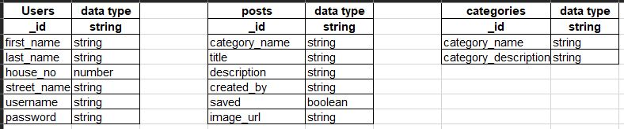

# Quahog City Council Bulletin Board  

## The Online Bulletin Board of the fictional city of Quahog                                          

The purpose of the project is to create an online platform for the citizens and the council to post ideas, announcements or advertisements to- much like a real-life bulletin board. 

My aim with the project is to create a full stack site that allows users to Create, Edit, Read and Delete data in a way that's easily manageable for all users as well as giving them a great user experience.

Please see the link to the live page below:

https://quahog-bulletin.herokuapp.com/

## UX

The registered user can easily get involved in and contribute to the life of their community. They can look for updates from the local council; they can post ads and invitations to events, clubs, goups and so on. They can offer and ask for help thereby strengthening the ties between the community members.
Unregistered users can still view the post but the site doesn't allow them to create their own posts or to save them for later.

## User stories

As a user I want to create new posts in different categories

As a user I want to upload photos to my posts.

As a user I want to be able to edit or delete my posts.

As a user I want to see announcements created by the city council.

As a user I want to see what other users posted in each category.

As a user I want to be able to save posts that I find interesting and view them in my profile page.

As a user I want to see who created each post.

As a user who has admin rights I want to be able to add a new category if needed.

As a user who is in a hurry I want to be able to filter the posts in each category for certain keywords.

As a user who is not a resident would like to see what's going on in the city anyway.

As a user who would like to get in touch with the Council directly I am interested in the contact details of the City hall.

## Wireframes

**Homepage**

      

**Login**

 

**Register**

 

**Profile**

  

**Boards (Categories)**

 
 

**CRUD**

**Create post**

 

**View post**

 

**Edit post**

 

**Delete post**

 

**Admin functions**

 

## Features

### Existing Features

#### On all pages:

- Navigation Bar: I have created the navigation bar using Materialize Nav bar with Icon Links and I have also included the Mobile Collapse Button. I added a dropdown option to one of the menu items.

- Page title: The page title appears will in the navigation bar on the right throughout the entire website and acts as a link to the home page when clicked.

- Mobile Collapse Button / Sidebar: The Mobile Collapse Button will appear on medium and small screens and shows the side navigation bar.

- Tooltips: Materialize tooltips show up to give the user further explanation on the purpose of certain fields in the registration form and buttons.

- Footer: from Materialize to include the contact details for the City Hall and copyright information.

#### Login

- Contains an input form where the users can enter their username and password.

- Flash message appears if the username is not valid or if the password is incorrect.

-"Register here" link below the form to get redirected to the registration page.

#### Register

- The app is accessible for read only to anyone, registered users have access to more functions such as creating, editing, saving and deleting posts. 

- Contains an input form where the user can enter their details and choose a username and password. A tooltip over each line gives the user helpful tips.

- Flash message appears if the chosen username is already in the database.

- In order to store the passwords securely in MongoDB, the passwords have been hashed.

#### Boards

- This page has been created to display all categories and to give an idea to the user what each category entails. 

- The content is displayed on cards, each of which has a link on the bottom to the page containing posts within each category.

- Admin is able to add a new category (AKA Board)

#### Categories

- This page has been created to display all posts in each category.

- The content of the posts is displayed on cards, each of which has a link on the bottom to the page containing posts within each category.

- Admin is able to add a new category (AKA Board)

#### Creating Posts

- The user first selects a category for the post

- The user can give a description, add contact details (name, phone number, address website etc.) if they wish.

- The user can upload a photo to their post by which will be saved in the database as well.

- The new post is created when the User clicks the Save button.

#### Profile

- After successful login, the user is greeted by a flash message.

- The User's profile page is divided into 2 sections: the top section contains all posts created by the user, the bottom section contains posts created by other users that the current user saved for easier access.

- The User has permission to edit or delete their own posts from here and also to remove posts from the saved section.

#### Admin

### Features left to implement

- Allow users to upload multiple images to each posts.

- Add a comment section whereby the users can communicate with each other more effectively.

## Technologies Used

- HTML5 

- CSS3 

- JavaScript

- Python3, Flask framework

- Jinja templating 

- Materialize style library

- MongoDB as my database

Schema

- Balsamiq for creating wireframes

- Font Awesome

- Google Fonts

Development environment:
I have used Gitpod to develop the app. I used Code Institute's Gitpod full template as my basis.

Version control system:
I have used Gitpod changes in the website by making regular commits with descriptive titles and pushed them to GitHub.

## Testing

### Testing in different browsers
Chrome I used Chrome throughout the development, so everything was tested in Chrome first. I frequently checked things on my Android phone with Chrome.

Safari I asked family members to check the page on Apple devices, it worked well on iPhone 4S, SE and 6.

Firefox and Microsoft Edge After autoprefixing my CSS, I checked functionality and appearance in Firefox and Edge, no issues found.

### Testing against the user stories

As user 1 I am able to create new posts in different categories from my profile or the category's page.

As user 2 I am able to upload a photo to my post from my computer when creating or editing the post.

As user 3 I can edit or delete my posts.

As user 4 I can see announcements created by the city council by clicking on the relevant link on the Boards page.

As user 5 I can to see what other users posted in each category by selecting the relevant category's page.

As user 6 I can save other users' posts by moving my mouse over the floating action button and clicking on the save icon. They are displayed in my profile page from where I can remove them

As user 7 I can see who created each post just by looking at each card or if clicking on view post.

As Admin I can create a new category from the Boards page.

As user 9 who is in a hurry I can use the search field on the categor's page to filter the posts for certain keywords.

As  user 10 who is not a resident I am allowed see what's going on in the city without logging in.

As user 11 who would like to get in touch with the Council directly I can find the contact details and opening hours in the footer of each page.

### Validation

I used https://validator.w3.org/ to validate the HTML code.

I used https://jigsaw.w3.org/css-validator/ to validate the CSS code.

I used https://jshint.com/  to check the JavaScript code.

## Problems encountered

Image upload
Saving posts
Categories page

## Deployment

The project is deployed to Heroku. https://quahog-bulletin.herokuapp.com/ . I closely followed the tutorial videos on Heroku which are part of the course.

1. First I created a new app in Heroku called quahog-bulletin. 

2. I created my repository on GitHub. I installed Heroku in my project by using the Heroku CLI in the terminal and logged into Heroku. 

3. I created requirements.txt and Procfile that Heroku requires to run the app:

  pip3 freeze -- local > requirements.txt

  echo web: python app.py > Procfile
  
  I pushed both files to GitHub then enabled automatic deploys to the master branch.
 
4. I connected Git remote to Heroku and pushed everything to Heroku master: git push -u heroku master

5. Within my repository I've created an env.py file that contains my environmental variables. I added env.py to gitignore file along with __pycache__/

6. In the  Heroku app's settings (Config Vars) I've added my environmental variables for the IP, PORT, MONGODB_URI and SECRET_KEY

7. Now the automatic deployment is set up I removed Heroku remote on Github: git remote rm heroku.

#### Differences between the deployed production version and the development version:

## Credits

### Content

### Media

### Acknowledgements
