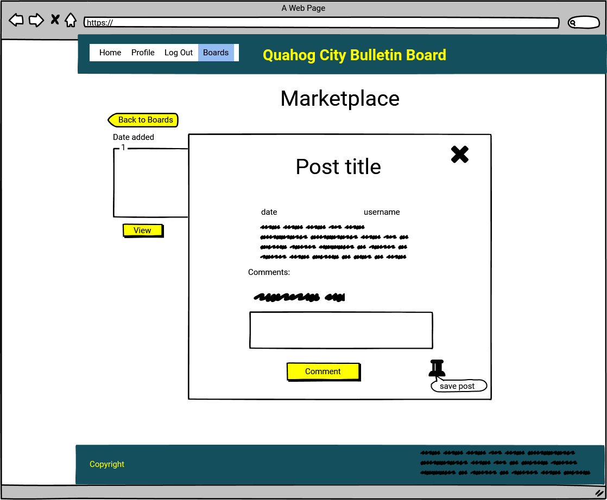

# Quahog City Council Bulletin Board  

## The Online Bulletin Board of the fictional city of Quahog                                          

The purpose of the project is to create an online platform for the citizens and the council to post ideas, announcements or advertisements to- much like a real-life bulletin board. 

My aim with the project is to create a full stack site that allows users to Create, Edit, Read and Delete data in a way that's easily manageable for all users as well as giving them a great user experience.

Please see the link to the live page below:

https://quahog-bulletin.herokuapp.com/

## UX

The registered user can easily get involved in and contribute to the life of their community. They can look for updates from the local council and start a conversation with them and other citizens; they can post ads and invitations to events, clubs, goups and so on. They can offer and ask for help thereby strengthening the ties between the community members.

## User stories

As a user I want to create new posts in different categories

As a user I want to upload photos to my posts.

As a user I want to be able to edit or delete my posts.

As a user I want to see announcements created by the city council.

As a user I want to see what other users posted in each category.

As a user I want to be able to leave comments under other user's posts.

As a user I want to be able to save posts that I find interesting and view them in my profile page.

As a user I want to see how many people saved each post. 

As a user I want to see when each post was created.

As a user who has admin right I want to be able to add a new category if needed.

As a user who is in a hurry I want to be able to filter the posts in each category for certain keywords.

As a user who is not a resident would like to see what's going on in the city anyway.

As a user who would like to get in touch with the Council directly I am interested in the contact details of the City hall.

## Wireframes

**Homepage**

 

**Login**

 

**Register**

 

**Profile**

**Boards (Categories)**

**CRUD**

**Create post**

**View post**

**Edit post**

**Delete post**

**Admin functions**

## Features

### Existing Features

#### On all pages:

- Navigation Bar: I have created the navigation bar using Materialize Nav bar with Icon Links and I have also included the Mobile Collapse Button. I added a dropdown option to one of the menu items.

- Page title: The page title appears will in the navigation bar on the right throughout the entire website and acts as a link to the home page when clicked.

- Mobile Collapse Button / Sidebar: The Mobile Collapse Button will appear on medium and small screens and shows the side navigation bar.

- Tooltips: Materialize tooltips show up to give the user further explanation on the purpose of certain fields in the registration form and buttons.

- Footer: from Materialize to include the contact details for the City Hall and copyright information.

#### Login

- Contains an input form where the users can enter their username and password.

- Flash message appears if the username is not valid or if the password is incorrect.

-"Register here" link below the form to get redirected to the registration page.

#### Register

- The app is accessible for read only to anyone, registered users have access to more functions such as creating, editing, saving and deleting posts as well as commenting. 

- Contains an input form where the user can enter their details and choose a username and password. A tooltip over each line gives the user helpful tips.

- Flash message appears if the chosen username is already in the database.

- In order to store the passwords securely in MongoDB, the passwords have been hashed.

#### Boards

#### Profile

#### Admin

### Features left to implement

## Technologies Used

- HTML5 

- CSS3 

- JavaScript

- Python3, Flask framework

-Jinja templating 

- Materialize style library

- MongoDB

Schema

- Heroku to deploy the project

- Balsamiq for creating wireframes

- Font Awesome

- Google Fonts

## Testing

### Testing in different browsers

### Testing against the user stories

### Validation

## Problems encountered

## Deployment

## Credits

### Content

### Media

### Acknowledgements
